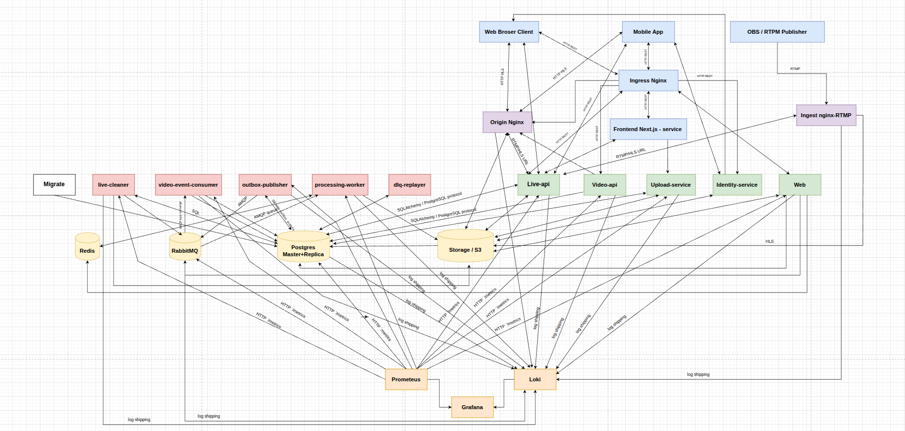

# Video Platform DevOps Project

Production-oriented видеоплатформа на FastAPI с микросервисной backend-архитектурой, асинхронной обработкой видео, event-driven взаимодействием, Kubernetes/Helm-деплоем и полноценным observability-стеком.

Проект представляет собой реально работающую distributed system с поддержкой web (Next.js) и mobile (Flutter) клиентов и используется как демонстрация DevOps/SRE-подхода к проектированию backend-платформ.

---

## Обзор проекта

Цель проекта — показать полный цикл разработки и эксплуатации backend-платформы:

- FastAPI микросервисная архитектура;
- upload → processing → playback video pipeline;
- event-driven взаимодействие через RabbitMQ;
- transactional outbox pattern;
- идемпотентность и retry-механизмы;
- Docker / Docker Compose локальный full stand;
- Kubernetes / Helm cloud deployment profile;
- Prometheus / Grafana / Loki / Alertmanager observability stack;
- GitLab CI/CD pipeline с автоматической проверкой и security scan.

---

## Ключевые возможности

- Event-driven обработка видео
- Transactional outbox pattern
- Идемпотентный upload pipeline
- RTMP → HLS live streaming
- Distributed background workers
- Kubernetes + Helm deployment
- PostgreSQL replication
- Retry / DLQ handling
- Централизованный monitoring и logging
- Production-oriented backend architecture

---

## Tech Stack

### Backend

- FastAPI
- SQLAlchemy
- PostgreSQL
- RabbitMQ
- Redis

### Infrastructure

- Docker
- Docker Compose
- Kubernetes
- Helm
- Minikube
- NGINX

### Streaming

- RTMP
- HLS
- FFmpeg
- nginx-rtmp

### Observability

- Prometheus
- Grafana
- Loki
- Alertmanager

### Frontend / Clients

- Next.js
- Flutter

---

# Архитектура

## Full Local Kubernetes Environment

Production-like локальный Kubernetes-стенд с:

- FastAPI микросервисами
- event-driven processing
- RTMP → HLS live streaming
- RabbitMQ event bus
- PostgreSQL replication
- centralized observability stack

[](docs/architecture/Complete_K8S_Stend.png)

Исходник схемы:
- `docs/architecture/Local_K8S_stend.drawio`

### Цветовая схема

- Blue — Clients & Entry Points
- Green — API Services
- Gray — Background Workers
- Purple — Streaming Services
- Yellow — Infrastructure & Storage
- Orange — Monitoring & Observability

---

## Cloud-ready архитектура

Архитектура проекта изначально проектировалась с учётом cloud deployment и горизонтального масштабирования.

---

### Stateless сервисы

- API и worker-сервисы не хранят состояние локально;
- состояние вынесено в PostgreSQL / RabbitMQ / Redis;
- сервисы могут масштабироваться независимо друг от друга.

---

### Storage abstraction

Платформа использует abstraction layer для storage provider.

Текущая реализация:
- локальное файловое хранилище.

Планируемая cloud-реализация:
- S3-compatible object storage;
- Selectel Object Storage;
- presigned upload/download URL;
- разделение compute и storage слоёв.

---

### Asynchronous processing

- тяжёлые задачи вынесены в background workers;
- RabbitMQ используется как event bus и buffer нагрузки;
- система устойчива к всплескам трафика и retry.

---

### Reliability patterns

В проекте реализованы:

- transactional outbox;
- at-least-once delivery;
- retry/backoff;
- dead-letter queue (DLQ);
- идемпотентные consumer-ы;
- distributed lock + TTL.

---

### Observability

- Prometheus metrics;
- Grafana dashboards;
- Loki centralized logging;
- Alertmanager alerts;
- request correlation через tracing headers.

---

### Kubernetes-ready

- Helm-based deployment;
- разделение environments;
- cloud demo-profile;
- независимо масштабируемые сервисы.

---

### Цели архитектуры

Система проектируется так, чтобы:

- быть переносимой в облако;
- масштабироваться по компонентам;
- выдерживать повторную доставку сообщений;
- оставаться наблюдаемой и диагностируемой;
- демонстрировать production-oriented backend engineering practices.

---

## Основной video pipeline

```text
upload-service
  -> PostgreSQL
  -> outbox_events
  -> outbox-publisher
  -> RabbitMQ
  -> processing-worker
  -> ffmpeg
  -> local storage / HLS
  -> video status update
  -> video-api playback
```

---

## Архитектурные особенности

### Transactional Outbox

- события сначала сохраняются в PostgreSQL;
- outbox-publisher асинхронно публикует их в RabbitMQ;
- retry/backoff предотвращают потерю сообщений;
- сохраняется консистентность между БД и брокером.

---

### Idempotency

- upload flow использует `client_upload_id`;
- processing использует lock token + TTL;
- consumer-ы устойчивы к повторной доставке;
- переходы состояний атомарны (`READY`, `FAILED`).

---

### Event-driven processing

Платформа использует асинхронное взаимодействие между сервисами:

```text
upload-service
    ↓
PostgreSQL + outbox_events
    ↓
outbox-publisher
    ↓
RabbitMQ
    ↓
processing-worker
    ↓
video-events-consumer
    ↓
video-api
```

---

## Environments

### Full Local Profile

Полный локальный стенд со всеми сервисами.

```bash
minikube start
kubectl apply -R -f deploy/k8s/base/
```

---

### Cloud Demo Profile

Облачный упрощённый профиль:

- Kubernetes + Helm
- reduced service set
- упрощённый deployment profile
- оптимизированное потребление ресурсов

---

## Kubernetes / Helm

Helm chart:

```text
deploy/helm/video-platform
```

Local Kubernetes manifests:

```text
deploy/k8s/base
```

---

## CI/CD

GitLab pipeline:

```text
.gitlab-ci.yml
```

Pipeline stages:

- lint
- test
- build
- container image build
- security scan (Trivy)
- deployment validation

---

## Monitoring & Observability

### Monitoring Stack

- Prometheus
- Grafana
- Loki
- Alertmanager
- node-exporter
- cAdvisor
- postgres-exporter

Документация:

```text
docs/monitoring.md
```

---

## Структура проекта

```text
app/
 ├── backend/              # FastAPI microservices
 ├── frontend/             # Next.js frontend
 └── mobile/               # Flutter client

deploy/
 ├── docker/               # Docker Compose environments
 ├── helm/                 # Helm charts
 └── k8s/                  # Kubernetes manifests

monitoring/
 ├── prometheus/
 ├── grafana/
 ├── loki/
 └── alertmanager/

docs/
 ├── architecture/
 ├── services/
 └── environments/
```

---

## Documentation

- `docs/architecture.md`
- `docs/services/service-map.md`
- `docs/events.md`
- `docs/monitoring.md`

---

## Current Status

Реализовано:

- full local Kubernetes stand;
- distributed FastAPI microservices;
- end-to-end video pipeline;
- RTMP → HLS live streaming;
- asynchronous event-driven processing;
- PostgreSQL replication;
- observability stack;
- Docker и Kubernetes environments.

В процессе:

- cloud Helm deployment;
- S3-compatible storage backend;
- deployment automation improvements;
- production deployment hardening.

---

## Назначение проекта

Проект предназначен для демонстрации:

- DevOps/SRE engineering practices;
- distributed backend architecture;
- asynchronous processing patterns;
- observability и diagnostics;
- Kubernetes и Helm deployment workflows;
- production-oriented system design.